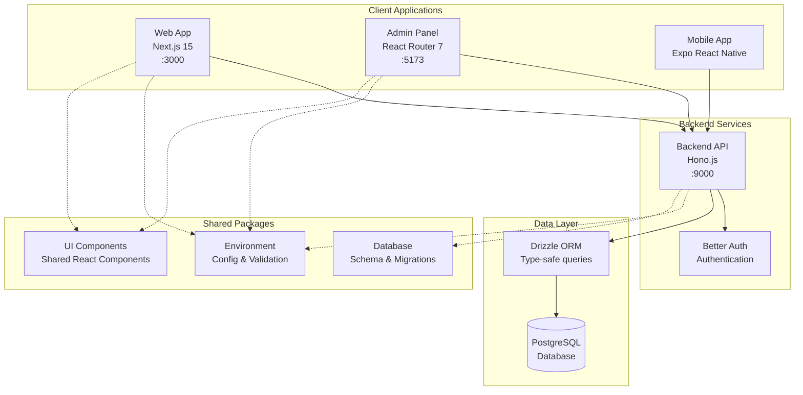
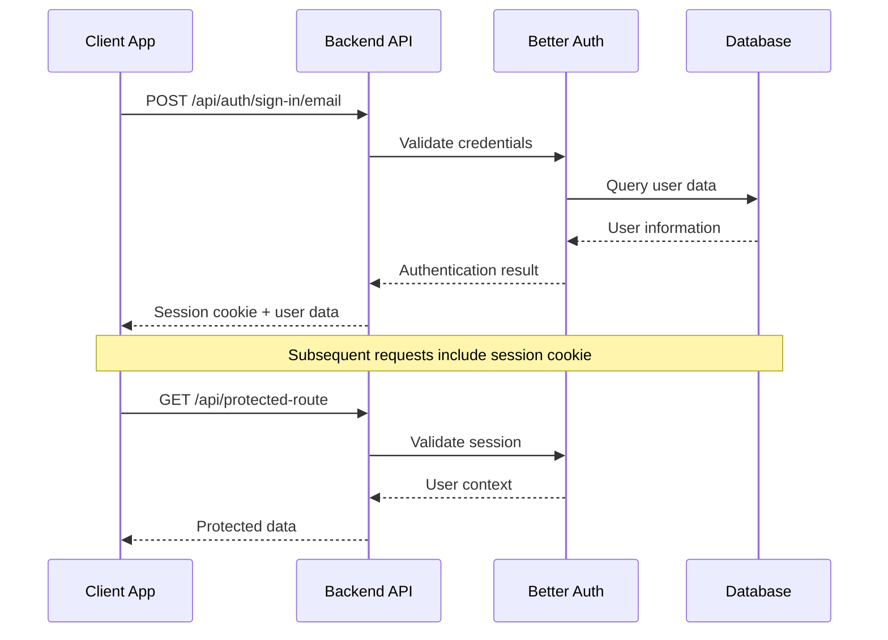
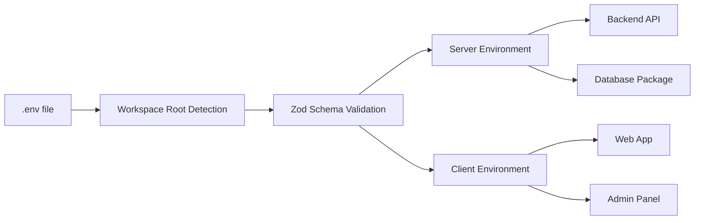
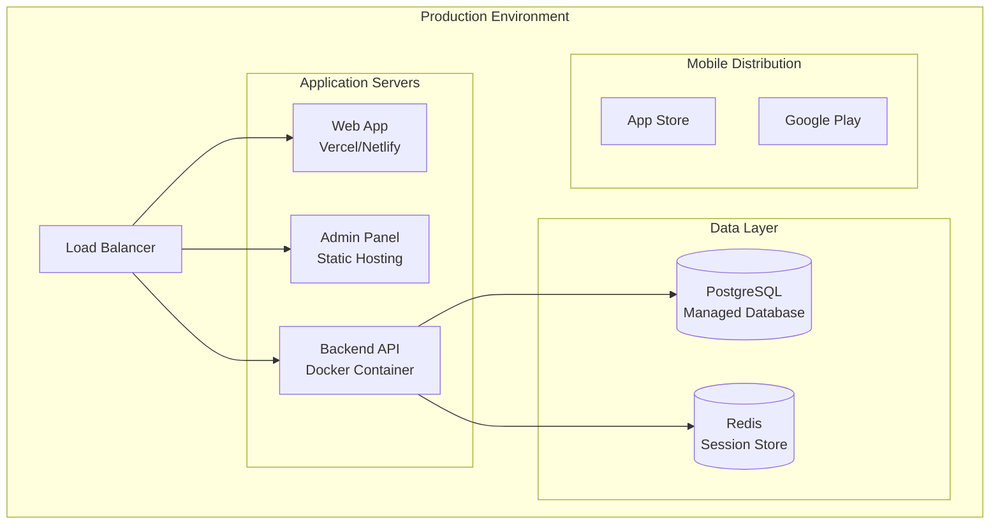

# Platform Architecture

The Oakford platform follows a modern monorepo architecture with clear separation of concerns, shared packages, and multiple client applications.

## High-Level Overview



## Application Layer

### Web Application (`apps/web`)
- **Framework**: Next.js 15 with App Router
- **Purpose**: Customer-facing web application
- **Features**: 
  - Server-side rendering and static generation
  - Authentication pages (login, register, forgot password)
  - Responsive design with Tailwind CSS
  - Type-safe API integration

### Admin Panel (`apps/admin`)
- **Framework**: React Router 7
- **Purpose**: Administrative interface for system management
- **Features**:
  - Modern routing with data loading
  - Admin authentication and authorization
  - Dashboard with system metrics
  - User and content management interfaces

### Mobile Application (`apps/mobile`)
- **Framework**: Expo React Native
- **Purpose**: Cross-platform mobile application
- **Features**:
  - iOS and Android support
  - Shared authentication with web apps
  - Native performance and UX

### Backend API (`apps/backend`)
- **Framework**: Hono.js
- **Purpose**: Centralized API server
- **Features**:
  - High-performance HTTP server
  - Better Auth integration
  - CORS configuration for multi-origin support
  - Type-safe request/response handling

## Shared Packages

### Environment Package (`packages/env`)
- **Purpose**: Centralized environment configuration
- **Features**:
  - Zod schema validation
  - Workspace root detection
  - Client/server environment separation
  - Type-safe environment variables

```typescript
// Server-side usage
import env from "@repo/env"
console.log(env.DATABASE_URL) // Validated and typed

// Client-side usage
import env from "@repo/env/client"
console.log(env.NEXT_PUBLIC_BACKEND_URL) // Only public vars
```

### Database Package (`packages/db`)
- **Purpose**: Database schema and ORM configuration
- **Features**:
  - Drizzle ORM setup
  - Database schema definitions
  - Migration management
  - Type-safe database queries

### UI Package (`packages/ui`)
- **Purpose**: Shared React components
- **Features**:
  - shadcn/ui component library
  - Consistent design system
  - Reusable across applications
  - TypeScript support

## Data Flow Architecture

### Authentication Flow



### Environment Configuration Flow



## Security Architecture

### Authentication & Authorization
- **Session-based Authentication**: Secure HTTP-only cookies
- **CORS Configuration**: Proper cross-origin request handling
- **Environment Separation**: Client/server environment variable isolation
- **Role-based Access**: Admin and user role differentiation

### Data Protection
- **Input Validation**: Zod schemas for all data inputs
- **SQL Injection Prevention**: Drizzle ORM parameterized queries
- **XSS Protection**: React's built-in XSS prevention
- **HTTPS Enforcement**: Production HTTPS requirements

## Development Architecture

### Monorepo Benefits
- **Code Sharing**: Shared packages reduce duplication
- **Type Safety**: End-to-end TypeScript integration
- **Consistent Tooling**: Unified development experience
- **Atomic Changes**: Cross-package changes in single commits

### Build System
- **Package Dependencies**: Clear dependency graph
- **Incremental Builds**: Only rebuild changed packages
- **Development Mode**: Hot reload across applications
- **Production Builds**: Optimized builds for deployment

### Testing Strategy
- **Unit Tests**: Individual package testing
- **Integration Tests**: Cross-package functionality
- **E2E Tests**: Full application workflows
- **Type Checking**: Compile-time error detection

## Deployment Architecture

### Production Deployment


### Scaling Considerations
- **Horizontal Scaling**: Multiple API server instances
- **Database Scaling**: Read replicas and connection pooling
- **CDN Integration**: Static asset distribution
- **Caching Strategy**: Redis for session and data caching

## Design Decisions

### Why Monorepo?
- **Shared Code**: Reduces duplication across applications
- **Atomic Changes**: Cross-application changes in single PR
- **Consistent Tooling**: Same development experience everywhere
- **Type Safety**: End-to-end type checking

### Why Hono.js?
- **Performance**: Faster than Express.js
- **Edge Runtime**: Cloudflare Workers compatibility
- **Type Safety**: Built-in TypeScript support
- **Modern API**: Clean, intuitive API design

### Why Better Auth?
- **Modern**: Built for current web standards
- **Flexible**: Supports multiple authentication methods
- **Type Safe**: Full TypeScript integration
- **Framework Agnostic**: Works with any framework

### Why Drizzle ORM?
- **Type Safety**: Compile-time query validation
- **Performance**: Minimal runtime overhead
- **SQL-like**: Familiar query syntax
- **Migration Support**: Built-in schema migrations

## Next Steps

- [Development Setup](/internal/development-setup/) - Set up your development environment
- [Environment Configuration](/internal/environment/) - Configure environment variables
- [Authentication System](/internal/authentication/) - Understand the auth implementation
- [Database Schema](/internal/database/) - Learn about the data model